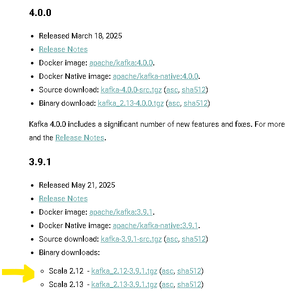
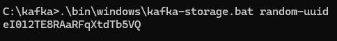
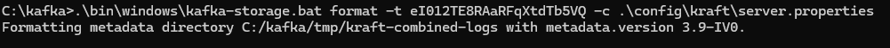
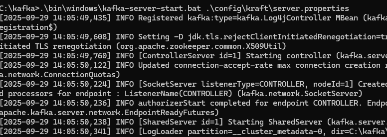
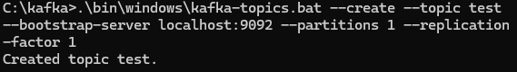
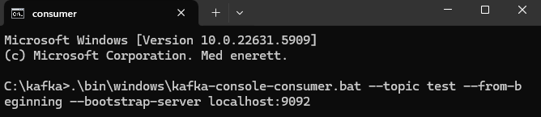
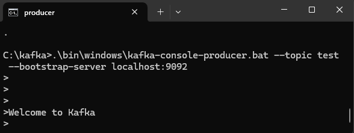
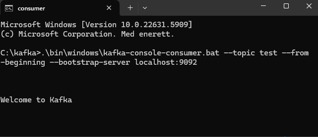

# Kafka Testing
## Install Kafka
Before installing kafka make sure you have java installed
in your cmd:
```
java --version
```
## Download Apache Kafka
Goto : https://kafka.apache.org/downloads

Download the version having Scala 2.12



- Now copy the inner folder from the zip, that is "kafka_2.12-3.9.1" and paste it under C:\
- Remane the folder to "kafka"

## Set Environment Variables

Open Edit Systemvariables in your system
- Under System variables add "KAFKA_HOME" with value "C:\kafka"
- Under path add a new path "C:\kafka\bin"

Click ok on all windows.

## Update server.properties for Kafka Logs

Under "C:\kafka\config\kraft" 
- open "reconfig-server.properties" file and rename the log path add "C:\kafka\ " before tmp
- open "server.properties" file in the same folder and rename the log path add "C:\kafka\ " before tmp

```
log.dirs=C:/kafka/tmp/kraft-combined-logs
```

## Generate Kafka Cluster ID

Now generate a unique ID, type "cmd" in C:\Kafka folder path and type the below command and press enter


```
.\bin\windows\kafka-storage.bat random-uuid
```



A unique id is generated!!!

## Format Kafka Storage

In the same window, type the format storage command and press enter

```
.\bin\windows\kafka-storage.bat format -t eI012TE8RAaRFqXtdTb5VQ -c .\config\kraft\server.properties
```



## Start the kafka server

In the same window, type server start command and press enter

```
.\bin\windows\kafka-server-start.bat .\config\kraft\server.properties
```


Now the kafka server is up and running - DO NOT CLOSE THIS WINDOW


### Create Kafka Topic

Open a new cmd window by typing "cmd" in C:\Kafka folder path and type the below command and press enter

```
.\bin\windows\kafka-topics.bat --create --topic test --bootstrap-server localhost:9092 --partitions 1 --replication-factor 1
```


A topic is created


## Check created topic

```
.\bin\windows\kafka-topics.bat --list --bootstrap-server localhost:9092
```

### Run Kafka Producer
In the same window, run the producer by typing the command below and press enter

```
.\bin\windows\kafka-console-producer.bat --topic test --bootstrap-server localhost:9092
```


### Run Kafka Consumer
Open a new cmd window by typing "cmd" in C:\Kafka folder path, to run the consumer and type the command below and press enter

```
.\bin\windows\kafka-console-consumer.bat --topic test --from-beginning --bootstrap-server localhost:9092
```




## Test Kafka Setup

To test the kafka,

- type "Welcome to Kafka" in the producer window and press enter



- The message should appear in our consumer window :)



Kafka is WORKING!!!!